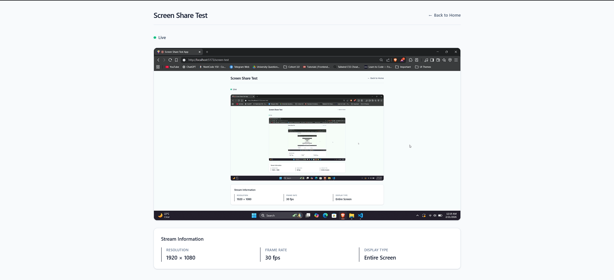
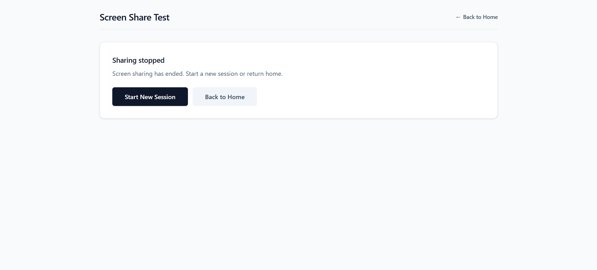

# Screen Share Test App

A frontend application demonstrating browser screen-sharing capabilities, media stream lifecycle management, and robust permission handling using React, TypeScript, and native Web APIs.

## 🚀 Live Demo

[Live Deployment](#) _(Add your deployment URL here)_

## 📋 Features

- ✅ Browser screen-sharing permission management
- ✅ Real-time media stream lifecycle handling
- ✅ Distinct success/failure state validation
- ✅ Live screen preview with metadata display
- ✅ Clean React state and resource management
- ✅ Mobile-responsive layout
- ✅ Proper cleanup on unmount

## 🛠️ Tech Stack

- **React** with Vite
- **TypeScript** - Type-safe development
- **Tailwind CSS** - Utility-first styling
- **React Router** - Client-side routing
- **Native Web APIs** - getDisplayMedia, MediaStream

## 📦 Setup Instructions

### Prerequisites

- Node.js (v18 or higher)
- npm or yarn
- Modern browser (Chrome/Edge recommended)

### Installation

1. **Clone the repository**

   ```bash
   git clone <your-repo-url>
   cd ScreenShare
   ```

2. **Install dependencies**

   ```bash
   npm install
   ```

3. **Run development server**

   ```bash
   npm run dev
   ```

4. **Open in browser**
   ```
   http://localhost:5173
   ```

### Build for Production

```bash
npm run build
npm run preview
```

## 🎯 Screen-Sharing Flow

### Part A: Homepage (`/`)

1. **Browser Support Check**
   - Verifies `navigator.mediaDevices.getDisplayMedia` availability
   - Shows browser-unsupported message if not available
   - Only Chrome and Edge on desktop are fully supported

2. **Navigation**
   - Button navigates to `/screen-test` route
   - Button is disabled if browser doesn't support screen sharing

### Part B: Screen Test Page (`/screen-test`)

#### Step 1: Permission Request

When the user clicks "Start Screen Share":

```javascript
navigator.mediaDevices.getDisplayMedia({
  video: { frameRate: { ideal: 30 } },
  audio: false,
});
```

**Distinct States Handled:**

- `requesting` - Waiting for user to select screen
- `granted` - Permission granted and stream active
- `cancelled` - User closed the picker without selecting
- `denied` - Permission explicitly denied
- `error` - Unknown/unexpected error

#### Step 2: Live Preview & Metadata

Once screen sharing starts:

- **Live Preview**: Displays in `<video>` element with autoplay
- **Metadata Extraction**: Using `track.getSettings()`
  - Resolution (width × height)
  - Frame rate (fps)
  - Display type (tab/window/entire screen)

#### Step 3: Stream Lifecycle Detection

The app detects when screen sharing stops via:

```javascript
track.onended = () => {
  // Update UI
  // Release tracks
  // Clear video element
};
```

**Triggers:**

- User manually stops sharing from browser UI
- Browser ends stream unexpectedly
- Tab/window being shared is closed

### Part C: End/Retry Flow

When screen sharing stops:

- Shows "Screen sharing stopped" message
- Provides two options:
  - **Retry Screen Test**: Fresh `getDisplayMedia` request
  - **Back to Home**: Returns to homepage

**Important:** Retry creates a completely new stream request and doesn't reuse old streams.

## 🏗️ Code Architecture

### Custom Hook: `useScreenShare`

Isolates all screen-sharing logic:

```typescript
const { status, stream, error, startScreenShare } = useScreenShare();
```

**Responsibilities:**

- Manages permission request
- Tracks stream state
- Handles error cases
- Provides cleanup function
- Detects stream end via `track.onended`

### Reusable Components

#### `<Button />`

Stateless, reusable button component with:

- Size variants (sm, md, lg)
- Disabled state handling
- Focus/hover states
- Keyboard accessibility

#### Pages

- `Home.tsx` - Stateless homepage
- `Screentest.tsx` - Screen test orchestrator (stateless where possible)

### Cleanup Strategy

```typescript
useEffect(() => {
  return () => {
    // Stop all tracks on unmount
    stream?.getTracks().forEach((track) => track.stop());
  };
}, []);
```

## 🌐 Browser Support

| Browser           | Support    | Notes                 |
| ----------------- | ---------- | --------------------- |
| Chrome (Desktop)  | ✅ Full    | Recommended           |
| Edge (Desktop)    | ✅ Full    | Recommended           |
| Firefox (Desktop) | ⚠️ Partial | May have limitations  |
| Safari (Desktop)  | ⚠️ Partial | Limited support       |
| Mobile Browsers   | ❌ No      | Not supported by spec |

## ⚠️ Known Limitations & Browser Quirks

### General Limitations

1. **No Mobile Support**
   - Screen sharing is not available on mobile browsers
   - UI gracefully handles this with unsupported message

2. **No Recording**
   - App only displays live preview
   - No backend streaming or recording implemented

3. **Frame Rate**
   - Requested ideal frame rate is 30fps
   - Actual frame rate may vary based on system capabilities

### Browser-Specific Quirks

#### Chrome/Edge

- **Display Surface Detection**: Reliably reports `tab`, `window`, or `monitor`
- **Cancellation**: Sometimes throws `AbortError`, sometimes `NotFoundError`
- **Auto-stop**: Automatically stops stream when source closes

#### Firefox

- **Limited Metadata**: May not always report `displaySurface`
- **Permission Prompt**: Slightly different UI
- **Audio**: Audio capture behavior differs

#### Safari

- **Older Versions**: `getDisplayMedia` may not be available
- **Metadata**: Limited `displaySurface` information
- **Quirks**: Stream behavior can be inconsistent

### Edge Cases Handled

✅ User cancels screen picker  
✅ User denies permission explicitly  
✅ User stops sharing from browser UI  
✅ Tab/window being shared closes  
✅ Multiple rapid retry attempts  
✅ Component unmount during active stream  
✅ Browser doesn't support screen sharing

## 📸 Screenshots

### Homepage


_Homepage with browser support check_

### Screen Test - Active


_Live screen preview with metadata_

### Screen Test - Stopped


_Retry/Back flow after stream ends_

## 🧪 Testing

### Manual Testing Checklist

- [ ] Start screen sharing successfully
- [ ] Cancel screen picker
- [ ] Deny screen sharing permission
- [ ] Stop sharing from browser UI
- [ ] Retry after stopping
- [ ] Navigate back to home
- [ ] Test on unsupported browser
- [ ] Test responsive layout
- [ ] Verify no memory leaks (check DevTools)

### Browser Testing

Test on:

- Chrome (latest)
- Edge (latest)
- Firefox (optional)

## 📝 Project Structure

```
src/
├── App.tsx                 # Router setup
├── main.tsx               # Entry point
├── index.css              # Tailwind imports
├── Components/
│   └── Button.tsx         # Reusable button
├── Hooks/
│   └── useScreenShare.tsx # Screen sharing logic
└── Pages/
    ├── Home.tsx           # Homepage
    └── Screentest.tsx     # Screen test page
```

## 🔧 Development Notes

- Uses Vite for fast development and HMR
- TypeScript for type safety
- Tailwind CSS v4 for styling
- No external screen-sharing libraries
- No mocked media streams - real browser testing only

## 📄 License

This project is for demonstration purposes.

---

**Note:** This implementation strictly follows the requirements of the Frontend Shortlisting Task. No external screen-sharing libraries were used - only native browser Web APIs.
